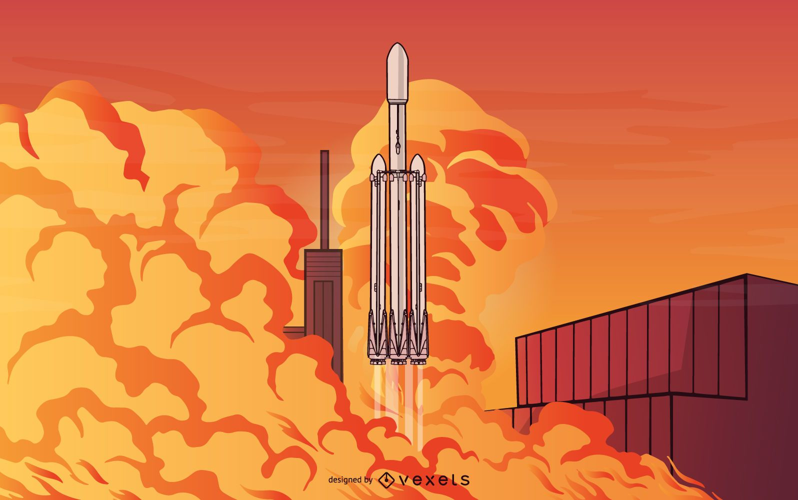

    

###

  
  
  
  
  

###

<h1 align="center">hey there 👋</h1>

###

<h2 align="left">👨‍💻 About Me</h2>

###

I'm Ismael from Córdoba, Argentina.  🔭 I’m currently seeking an internship to put all my knowledge into practice and grow professionally. 📚 I'm currently learning machine learning, DevOps, and web development to enhance my technical skills and expand my expertise. ⚡ In my free time, I enjoy scouting, exploring technology projects, and developing personal applications to solve everyday challenges.

###

<h2 align="left">🛠 Language and tools</h2>

###

  
  
  
  
  
  
  
  
  
  
  
  
  
  
  

###
